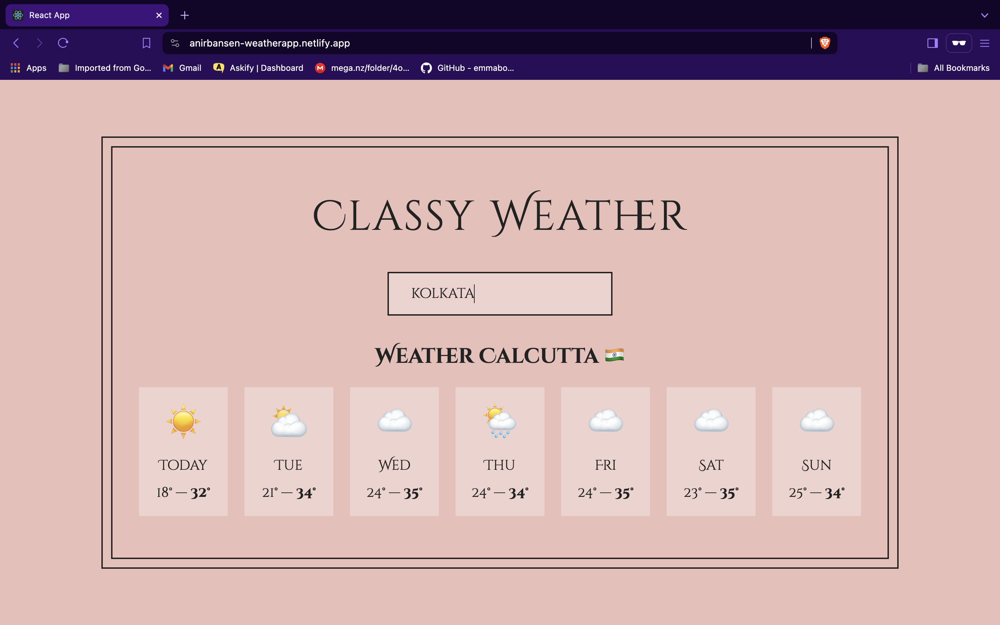

# WeatherApp - A Weather Predictor
Welcome to WeatherApp, your go-to destination for accurate weather forecasts! With WeatherApp, you can stay ahead of the weather with a 7-day forecast at your fingertips. Whether you're planning a weekend getaway or just curious about the upcoming weather in your area, WeatherApp has got you covered.

# Features

🌤️ 7-Day Forecast: Get detailed weather forecasts for the next 7 days, helping you plan ahead with confidence.

📍 Location Input: Easily input location names to get weather predictions for specific areas, ensuring you're prepared no matter where you are.

🌍 Country Flags: Integrated country flag display for selected locations, adding a visual touch to your weather experience.

📊 Real-Time Data: Utilizing a third-party weather API, WeatherApp provides real-time weather data for accurate and up-to-date forecasts.

# Screenshots
📸 

# LIVE SITE
🔗 Explore the live version of WeatherApp <a href="https://anirbansen-weatherapp.netlify.app/" target="_blank">here</a>

Stay informed and prepared for any weather condition with WeatherApp!
 
